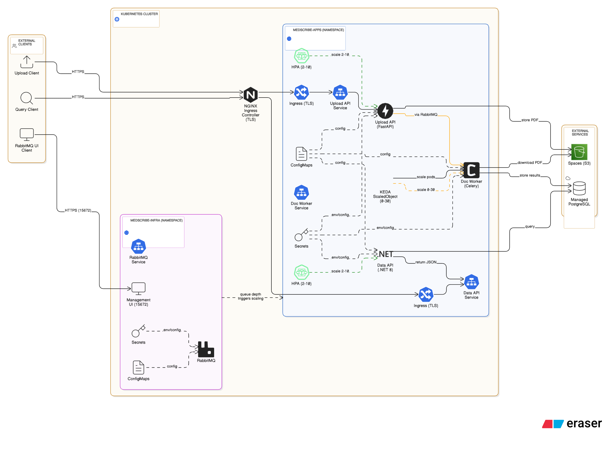
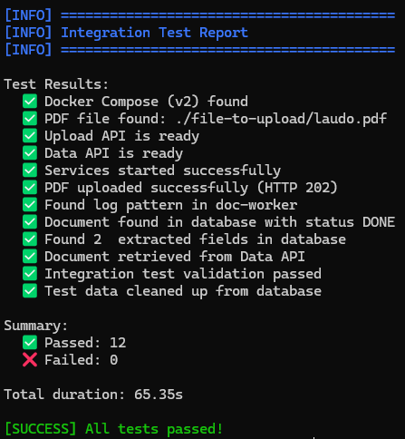

## **MedScribe**

> **Turning medical handwriting into structured intelligence.**

**MedScribe** is a distributed, cloud-native system designed to extract structured data from scanned medical reports (PDFs containing both printed and handwritten content).
Built on top of **DigitalOcean Kubernetes (DOKS)**, it leverages **microservice architecture**, **asynchronous pipelines**, and **AI-powered OCR/HTR** (Optical & Handwritten Text Recognition) to transform unstructured medical documents into reliable, queryable data.

---

### **Architecture Overview**


[View on Eraser.io](https://app.eraser.io/workspace/7m6AQymLmmVPOItrSCPB)

---

### **Core Capabilities**

* **Smart ingestion pipeline:** Receives and validates scanned PDFs uploaded by users or integrated systems.
* **AI-powered processing:** Uses Python OCR/HTR pipelines (Tesseract + TrOCR ONNX) optimized for **CPU-only environments**.
* **Structured extraction:** Maps results into well-defined data schemas using confidence scoring and field-level bounding boxes.
* **Data APIs:** Exposes clean, normalized information through RESTful endpoints for easy integration with other platforms.
* **Scalable by design:** Horizontally scales via **KEDA** and **Helm charts**, enabling elastic workloads per document volume.

---

### **Architecture Overview**

| Component          | Description                                                                                                                                                       |
| ------------------ | ----------------------------------------------------------------------------------------------------------------------------------------------------------------- |
| **Upload API**     | FastAPI service that receives PDF files, stores them in DigitalOcean Spaces (S3), and enqueues jobs to RabbitMQ.                                                  |
| **Doc Worker**     | Celery-based processor that downloads PDFs, performs OCR/HTR, applies text normalization, and stores structured results in PostgreSQL.                            |
| **Data API**       | REST service exposing document metadata, extracted fields, confidence levels, and processing status.                                                              |
| **Infrastructure** | Deployable via Helm charts (`k8s-helm-*`), with observability (Prometheus/Grafana), auto-scaling (KEDA), and secure configuration through Secrets and ConfigMaps. |

---

### **Tech Stack**

* **Languages:** Python 3.12, C# (.NET 8.0)
* **Frameworks:** FastAPI, Celery, ASP.NET Core
* **AI/ML:** Tesseract OCR, TrOCR (Hugging Face ONNX Runtime), OpenCV, Transformers, SentencePiece
* **PDF Processing:** PyMuPDF (fitz), pdf2image, Poppler
* **Image Processing:** Pillow, NumPy
* **Storage:** DigitalOcean Spaces (S3), PostgreSQL 17, MinIO (local dev)
* **Database Libraries:** asyncpg, Npgsql, SQLAlchemy, Alembic, Dapper
* **Messaging:** RabbitMQ
* **Data Validation:** Pydantic, Pydantic Settings
* **JSON Processing:** orjson
* **Retry Logic:** Tenacity
* **Cloud SDKs:** boto3 (AWS SDK for Python)
* **API Documentation:** Swagger/OpenAPI (Swashbuckle for .NET)
* **Web Servers:** Uvicorn (ASGI)
* **Deployment:** Kubernetes (DOKS) + Helm + KEDA, Docker, Docker Compose
* **Observability:** Prometheus, Grafana, Loki, OpenTelemetry, prometheus-net

---

### **Key Design Principles**

* **Cloud-Native & Stateless:** All components are containerized, horizontally scalable, and loosely coupled.
* **Resilient Pipelines:** Retry/backoff, DLQ support, and idempotent document handling (`sha256` hash).
* **Performance-Oriented:** Lightweight OCR models optimized for CPU; no GPU dependency.
* **Auditability:** Each extracted field is stored with confidence scores and bounding boxes for traceability.
* **Security:** TLS, restricted API keys, and encrypted storage.

---

### **Repository Structure**

```
MedScribe/
├─ apps/
│  ├─ upload-api/         → PDF ingestion and queuing
│  ├─ doc-worker/         → OCR/HTR processing pipeline
│  └─ data-api-dotnet/           → Data access and integration layer
├─ k8s-helm-upload-api/   → Helm chart for Upload API
├─ k8s-helm-doc-worker/   → Helm chart for Worker + KEDA scaling
├─ k8s-helm-data-api-dotnet/     → Helm chart for Data API
├─ k8s-helm-rabbitmq/     → Helm chart for RabbitMQ broker
├─ docs/                  → Architecture diagrams, runbooks, and API contracts
├─ integration-test/      → End-to-end integration test scripts
├─ localhost/             → Docker Compose configuration for local development
└─ tools/                 → Automation scripts and CI/CD utilities
```

---

### **Deployment**

```bash
# Build and push Docker images
docker build -t registry.digitalocean.com/org/medscribe-upload-api:1.0.0 apps/upload-api
docker push registry.digitalocean.com/org/medscribe-upload-api:1.0.0

# Install via Helm
helm upgrade --install upload-api ./k8s-helm-upload-api -n medscribe-apps
helm upgrade --install doc-worker ./k8s-helm-doc-worker -n medscribe-apps
helm upgrade --install data-api-dotnet ./k8s-helm-data-api-dotnet ./k8s-helm-data-api-dotnet -n medscribe-apps
helm upgrade --install rabbitmq ./k8s-helm-rabbitmq -n medscribe-infra
```

---

### **Integration Tests**

MedScribe includes comprehensive integration test scripts that validate the entire system end-to-end, from PDF upload through processing to data retrieval.



**Quick Start:**

```bash
# Linux/Mac
cd integration-test
chmod +x exec-integration-test.sh
./exec-integration-test.sh

# Windows
cd integration-test
.\exec-integration-test.ps1
```

**What the Tests Cover:**

The integration tests automatically:
1. Start all services using Docker Compose (`localhost/docker-compose.yaml`)
2. Validate service health and startup logs
3. Upload a test PDF document (`integration-test/file-to-upload/laudo.pdf`)
4. Monitor document processing through the pipeline
5. Verify database records (documents and extracted fields)
6. Query the Data API to retrieve processed data
7. Validate end-to-end results
8. Clean up test data

**Test Scripts:**

* `exec-integration-test.sh` - Bash script for Linux/Mac
* `exec-integration-test.ps1` - PowerShell script for Windows

Both scripts provide colored output, detailed progress reporting, and comprehensive error handling. See the [Integration Tests README](integration-test/README.md) for detailed documentation, troubleshooting, and prerequisites.

---

### **Application Tests**

Each application in the MedScribe system includes a comprehensive test suite following Test-Driven Development (TDD) best practices:

#### **Upload API Tests** (`apps/upload-api/tests/`)
FastAPI application tests using **pytest** with async support. Covers:
- Unit tests for schemas, settings, S3 client, database client, and message queue publisher
- Integration tests for FastAPI endpoints (`/upload`, `/healthz`)
- Mocking strategies for external dependencies (S3, PostgreSQL, RabbitMQ)
- **See:** [Upload API Tests README](apps/upload-api/tests/README.md)

#### **Doc Worker Tests** (`apps/doc-worker/tests/`)
Celery worker pipeline tests using **pytest**. Covers:
- Unit tests for models, settings, PDF loader, rasterizer, image preprocessing, OCR/HTR functions, field extraction, and database persistence
- Integration tests for the complete document processing pipeline
- Mocking strategies for OCR libraries (Tesseract), PDF processing (PyMuPDF), and async database operations
- **See:** [Doc Worker Tests README](apps/doc-worker/tests/README.md)

#### **Data API .NET Tests** (`apps/data-api-dotnet/tests/`)
ASP.NET Core API tests using **xUnit** and **FluentAssertions**. Covers:
- Unit tests for models, data access layer, and SQL query validation
- Integration tests for REST endpoints with `WebApplicationFactory`
- Custom attributes for conditional test execution (database availability checks)
- **See:** [Data API .NET Tests README](apps/data-api-dotnet/tests/README.md)

**Running Tests:**

```bash
# Upload API
cd apps/upload-api
pytest --cov=src --cov-report=term-missing

# Doc Worker
cd apps/doc-worker
pytest --cov=src --cov-report=term-missing

# Data API .NET
cd apps/data-api-dotnet/tests
dotnet test --collect:"XPlat Code Coverage"
```

---

### **Documentation**

* [Architecture Overview](docs/architecture.md)
* [Data Dictionary](docs/data-dictionary.md)
* [API Contracts (OpenAPI)](docs/api-contracts.md)
* [Integration Tests](integration-test/README.md)
* **Application Tests:**
  * [Upload API Tests](apps/upload-api/tests/README.md)
  * [Doc Worker Tests](apps/doc-worker/tests/README.md)
  * [Data API .NET Tests](apps/data-api-dotnet/tests/README.md)

---

### **Contributing**

Contributions are welcome!
Please follow the [CONTRIBUTING.md](CONTRIBUTING.md) guidelines, ensure your commits are signed, and validate your changes through CI before submitting a pull request.

---

### **License**

Released under the **MIT License**.
© 2025 BRHRMASTER – MedScribe Project.
